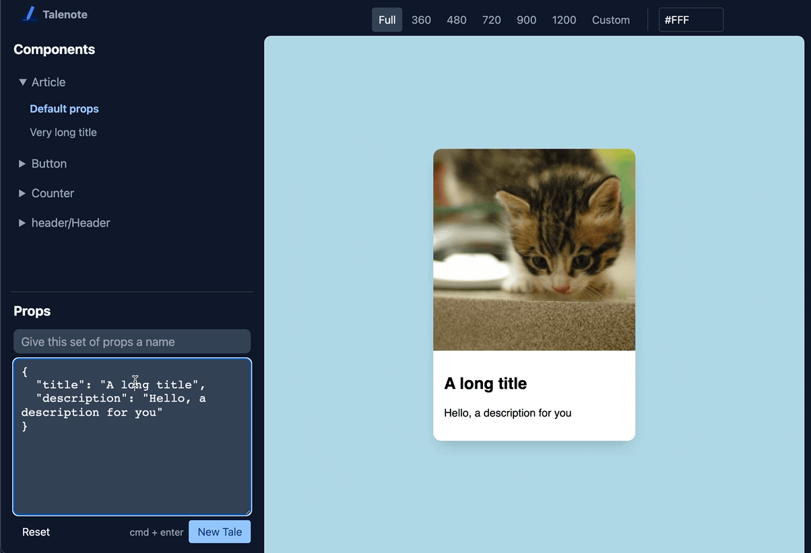

# TaleNote

Storybook-esque component directory, embed right into SvelteKit

> Please give it a try, but setting up is a PITA right now. It also only supports SvelteKit from ^1.0.0-next.250

Setting up Storybooks with SvelteKit is a daunting task that's overkill for static / content-focused websites.

TaleNote doesn't run a separate server — instead, it is embedded into SvelteKit's `routes` directory directly & relies on Vite's glob import to access other components.



## Features

- List all components from a directory or more
- View a component at different, customizable breakpoints
- Saving snapshots of props as 'tales'

## Setting up

Install `talenote`:

```sh
npm install talenote
```

In `routes`, create the following structure:

```
routes
  └─ talenote
        ├─ __layout.reset.svelte
        ├─ _tales.json
        ├─ component.svelte
        ├─ index.svelte
        └─ tales.js

```

> Directory & filenames are currently hardcoded. [There's an example of what these files look like here](https://github.com/d4rekanguok/talenote/tree/main/src/routes/talenote)

### `__layout.reset.svelte`

Just to reset the parent layout, if any.

```
<slot />
```

### `_tales.json`

This is where all the props snapshots will be stored. For starter, just leave this in:

```
{}
```

> I'm 90% confident that `lowdb` would just create one if there's none, please let me know if it doesn't.

### `component.svelte`

Talenote will mount a Svelte component into this page & load it into an iframe. This is the place to pass in components & any wrapper components.

```svelte
<script context="module">
	// Write a glob to get your handsome components here. Are they in `lib`? or maybe `components`?
	const modules = import.meta.globEager('/src/lib/**/*.svelte');
</script>

<script>
	import { DisplayComponent } from 'talenote';
</script>

<DisplayComponent {modules} />
```

### `index.svelte`

This is where Talenote UI lives.

```svelte
<script lang="ts">
	import { TaleNote } from 'talenote';

	// not required, just something to get the component name instead of the full file path
	const getComponentName = (name: string) => name.split('/src/lib/')[1].split('.svelte')[0];
</script>

<TaleNote {getComponentName} />
```

### `tales.js` (or `.ts`)

Talenote uses `lowdb` to write snapshots of your component props into a local json file. This file exports the required HTTP operations.

```ts
import path from 'path';
import { createAPI } from 'talenote';

// __dirname is not a thing with ESM, emulates it with import.meta.url
const taleDir = path.join(import.meta.url, '..').replace('file:', '');
const pathToJson = path.join(taleDir, '_tales.json');
const { post, get, del } = createAPI({ pathToJson });

export { post, get, del };
```

> Note: I always run into strange ESM errors after launching `/talenote` for the first time. Hard refresh and / or reinstalling `node_modules` a few times usually fixes them... let me know if you have an idea how to improve this.

## Configurations

### Set default props

Because Talenote doesn't run any static code analysis, the only way to recognize a component's default props is to export them from that component.

```svelte
<script context="module">
	export const defaultProps = { name: 'Eri' };
</script>

<script>
	export let name = defaultProps.name;
</script>

<h1>Hello {name}</h1>
```

### Configure wrapper components

When viewing small components such as a button, it's helpful to have them centered on the screen. From within a component, export a `taleWrapper` with the id of the wrapper. Valid defaults are `center` and `none`.

```svelte
<script context="module">
	export const defaultProps = { name: 'Eri' };

	// center this component
	export const taleWrapper = 'center';

	// alternatively, dont use any wrapper
	export const taleWrapper = 'none';
</script>

<script>
	export let name = defaultProps.name;
</script>

<h1>Hello {name}</h1>
```

Additional wrappers can be passed into `talenote/component.svelte`:

```svelte
<script context="module">
	const modules = import.meta.globEager('/src/components/**/*.svelte');
</script>

<script>
	import { DisplayComponent } from 'talenote';
	import CustomWrapper from './_CustomWrapper.svelte';

	const wrappers = {
		custom: CustomWrapper,

		// set the component above as the default for all components
		default: 'custom'
	};
</script>

// talenote/component.svelte
<DisplayComponent {modules} {wrappers} />
```

### Exclude Talenote from production builds

Starting from 1.0.0-next.249, `kit.routes` is available in `svelte.config.js` to filter out unwanted paths.

```js
// svelte.config.js
const config = {
	// Consult https://github.com/sveltejs/svelte-preprocess
	// for more information about preprocessors
	preprocess: preprocess(),

	kit: {
		adapter: adapter(),
		target: '#svelte',
		routes: (filepath) => {
			return process.env.NODE_ENV === 'production' ? !filepath.includes('talenote') : true;
		}
	}
};
```

## Caveats

- Because component props are serialized & passed back & forth via `window.postMessage`, functions props are excluded.

- Tales (component props snapshot) can only be viewed locally, though the component directory can still be shipped.


## Contributions

Ideas, PRs, contributions, forks are all welcomed!
Built by [dereknguyen](https://twitter.com/DerekNguyen10)